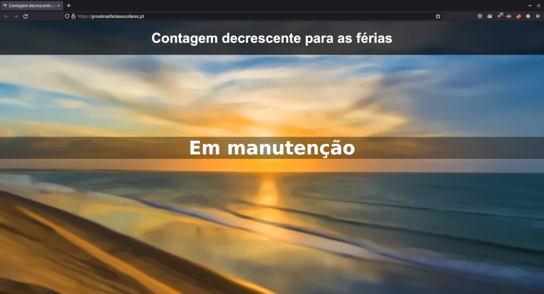

#  [Próximas Férias Escolares](https://proximasferiasescolares.pt)

Site de contagem regressiva para as férias escolares.

### História

Este site começou como diversão no secundário. O meu gosto por *backend* levou me a criar este simples site e a hospedá-lo.

Inicialmente foi hospedado na minha casa, onde tenho alguns PC's velhos como servidor.
Como me queria preocupar menos com potencial *downtime* passei a hospedá-lo num servidor virtual na Domínios, mas isso tornou-se demasiado caro quando os preços aumentaram.
Entretanto passei a hospedá-lo num servidor virtual na OVH onde está até aos dias de hoje.

### Objetivo

Esta é a versão 2.0 do website. Desenvolvido em React, para melhorar um pouco os meus conhecimentos de *frontend*. Este site será hospedado (em princípio) na AWS (Amazon Web Services) como parte do meu processo de aprendizagem de sistemas de *"cloud"*.

### Alterações planeadas

- Todo o código (praticamente);
- As datas das férias deixarão de ser *hardcoded* (em princípio virão de um API mas veremos).

Versão 1 do site (em manutenção porque as datas *hardcoded* eram difíceis de manter)

## :gb: :us:

Countdown website to school holidays.

### History

This website started as a fun project in high school. My liking for backend led me to create this simple website and host it.

It was initially hosted at home where I have some old PC's running as server. Since I wanted to worry less with any potential downtime I started hosting it in a virtual server in Domínios (Portuguese hosting company), but that became too expensive when prices increased.
Meanwhile I started hosting it in a virtual server in OVH where it is to this day.

### Objective

This is version 2.0 of the website. Developed in React, so that I would improve a bit my frontend skills. This website will be hosted in AWS as part of my process of learning more about the "cloud".

### Planned changes

- Entire codebase (pretty much);
- The dates will stop being hardcoded (they will probably come from an API, but we'll see).

Version 1 of the website (under maintenance since the hardcoded dates were a pain to take care of)
